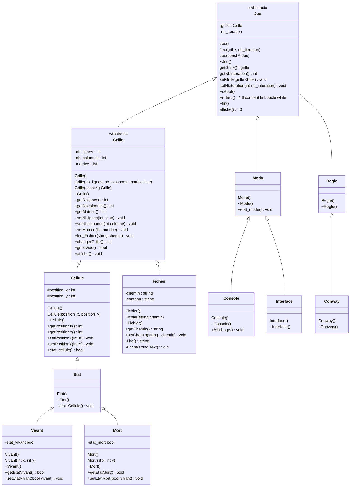

# Jeu_De_La_Vie

# Diagramme de classe

```mermaid
classDiagram

    class Jeu{
        <<Abstract>>
        -grille : Grille
        -nb_iteration
        
        Jeu()
        Jeu(grille, nb_iteration)
        Jeu(const *j Jeu)
        ~Jeu()

        getGrille() grille
        getNbinteration() int

        setGrille(grille Grille) void
        setNbiteration(int nb_interation) void

        +début()
        +milieu() # Il contient la boucle while 
        +fin()

        affiche()=0 
    }

    class Grille{
        <<Abstract>>
        -nb_lignes : int
        -nb_colonnes : int 
        -matrice : list

        Grille()
        Grille(nb_lignes, nb_colonnes, matrice liste)
        Grille(const *g Grille)
        ~Grille()

        +getNblignes() int
        +getNbcolonnes() int
        +getMatrice() list
        
        +setNblignes(int ligne) void
        +setNbcolonnes(int colonne) void
        +setMatrice(list matrice) void

        +lire_Fichier(string chemin) void
        +changerGrille() list
        +grilleVide() bool

        +affiche() void
    }

    class Cellule{
        #position_x : int
        #position_y : int
        
        Cellule()
        Cellule(position_x, position_y)
        ~Cellule()

        +getPositionX() int
        +getPositionY() int

        +setPositionX(int X) void
        +setPositionY(int Y) void 

        +etat_cellule() bool
    }

    class Vivant{
        -etat_vivant bool

        Vivant()
        Vivant(int x, int  y)
        ~Vivant() 
        
        +getEtatVivant() bool
        +setEtatVivant(bool vivant) void
    }

    class Mort{
        -etat_mort bool

        Mort()
        Mort(int x, int  y)
        ~Mort() 
        
        +getEtatMort() bool
        +setEtatMort(bool vivant) void
    }

    class Etat{

        Etat()
        ~Etat()

        +etat_Cellule() void
    }

    class Fichier{
        -chemin : string
        -contenu : string

        Fichier()
        Fichier(string chemin)
        ~Fichier()

        +getChemin() string
        +setChemin(string _chemin) void

        -Lire() string
        -Ecrire(string Text) void
    }

    class Mode{
        Mode()
        ~Mode()

        +etat_mode() void
    }

    class Console{

        Console()
        ~Console()

        +Affichage() void
    }

    class Interface{
        Interface()
        ~Interface()
    }

    class Regle{

        Regle()
        ~Regle()
    }

    class Conway{

        Conway()
        ~Conway()
    }


Jeu<|--Grille
Jeu<|--Mode
Jeu<|--Regle
Mode<|--Console
Mode<|--Interface
Grille<|--Cellule
Grille<|--Fichier
Cellule<|--Etat
Etat<|--Vivant
Etat<|--Mort
Regle<|--Conway
```