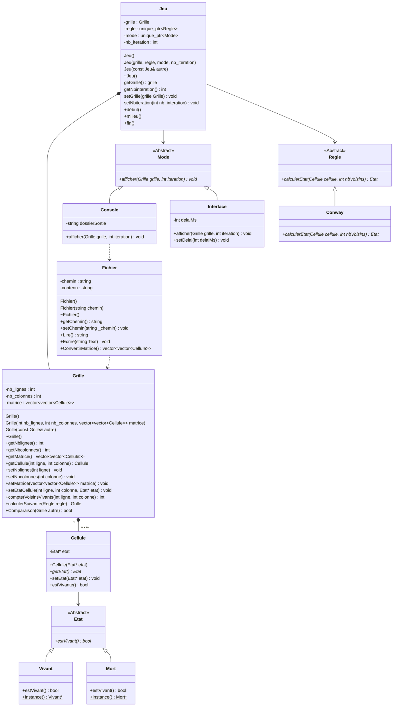
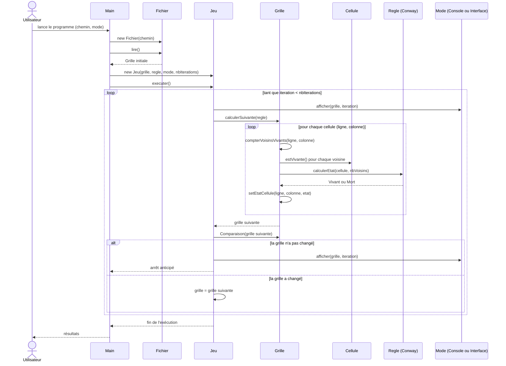
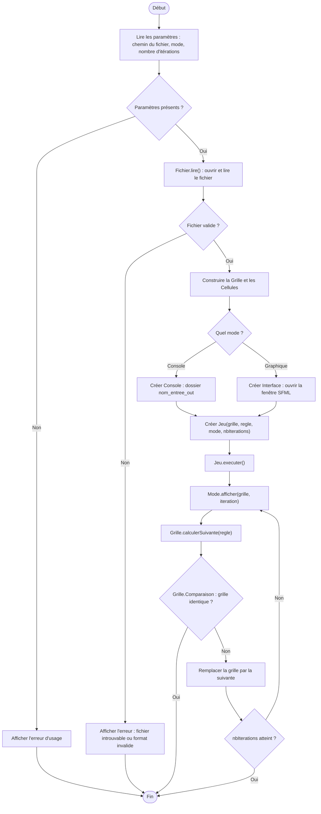

# Jeu_De_La_Vie

# Diagramme de classe

```mermaid
classDiagram

    class Jeu{
        -grille : Grille
        -regle : unique_ptr~Regle~
        -mode : unique_ptr~Mode~
        -nb_iteration : int
        
        Jeu()
        Jeu(grille, regle, mode, nb_iteration)
        Jeu(const Jeu& autre)
        ~Jeu()

        getGrille() grille
        getNbinteration() int

        setGrille(grille Grille) void
        setNbiteration(int nb_interation) void

        +début()
        +milieu()  
        +fin()
    }

    class Grille{
        -nb_lignes : int
        -nb_colonnes : int 
        -matrice : vector~vector~Cellule~~

        Grille()
        Grille(int nb_lignes, int nb_colonnes, vector~vector~Cellule~~ matrice)
        Grille(const Grille& autre)
        ~Grille()

        +getNblignes() int
        +getNbcolonnes() int
        +getMatrice() vector~vector~Cellule~~
        +getCellule(int ligne, int colonne) Cellule
        
        +setNblignes(int ligne) void
        +setNbcolonnes(int colonne) void
        +setMatrice(vector~vector~Cellule~~ matrice) void
        +setEtatCellule(int ligne, int colonne, Etat* etat) void

        +compterVoisinsVivants(int ligne, int colonne) int
        +calculerSuivante(Regle regle) Grille
        +Comparaison(Grille autre) bool
    }

    class Cellule{
        -Etat* etat
        +Cellule(Etat* etat)
        +getEtat() Etat*
        +setEtat(Etat* etat) void
        +estVivante() bool
    }

    class Vivant {
        +estVivant() bool
        +instance() Vivant*$
    }

    class Mort {
        +estVivant() bool
        +instance() Mort*$
    }

    class Etat{
        <<Abstract>>
        +estVivant() bool*
    }

    class Fichier{
        -chemin : string
        -contenu : string

        Fichier()
        Fichier(string chemin)
        ~Fichier()

        +getChemin() string
        +setChemin(string _chemin) void

        +Lire() string
        +Ecrire(string Text) void
        +ConvertirMatrice() vector~vector~Cellule~~
    }

    class Mode{
        <<Abstract>>
        +afficher(Grille grille, int iteration) void*
    }

    class Console{
        -string dossierSortie
        +afficher(Grille grille, int iteration) void
    }

    class Interface{
        -int delaiMs
        +afficher(Grille grille, int iteration) void
        +setDelai(int delaiMs) void
    }

    class Regle{
        <<Abstract>>
        +calculerEtat(Cellule cellule, int nbVoisins) Etat*
    }

    class Conway{
        +calculerEtat(Cellule cellule, int nbVoisins) Etat*
    }


Jeu *--Grille
Jeu-->Mode
Jeu-->Regle
Mode<|--Console
Mode<|--Interface
Fichier ..> Grille
Console ..> Fichier
Cellule-->Etat
Etat<|--Vivant
Etat<|--Mort
Regle<|--Conway
Grille "1" *-- "n x m" Cellule
```

# Diagramme de séquence

```mermaid
sequenceDiagram
    actor Utilisateur
    participant Main
    participant Fichier
    participant Jeu
    participant Grille
    participant Cellule
    participant Regle as Regle (Conway)
    participant Mode as Mode (Console ou Interface)

    Utilisateur->>Main: lance le programme (chemin, mode)
    Main->>Fichier: new Fichier(chemin)
    Main->>Fichier: lire()
    Fichier-->>Main: Grille initiale

    Main->>Jeu: new Jeu(grille, regle, mode, nbIterations)
    Main->>Jeu: executer()

    loop tant que iteration < nbIterations
        Jeu->>Mode: afficher(grille, iteration)
        Jeu->>Grille: calculerSuivante(regle)

        loop pour chaque cellule (ligne, colonne)
            Grille->>Grille: compterVoisinsVivants(ligne, colonne)
            Grille->>Cellule: estVivante() pour chaque voisine
            Grille->>Regle: calculerEtat(cellule, nbVoisins)
            Regle-->>Grille: Vivant ou Mort
            Grille->>Grille: setEtatCellule(ligne, colonne, etat)
        end

        Grille-->>Jeu: grille suivante
        Jeu->>Grille: Comparaison(grille suivante)

        alt la grille n'a pas changé
            Jeu->>Mode: afficher(grille, iteration)
            Jeu-->>Main: arrêt anticipé
        else la grille a changé
            Jeu->>Jeu: grille = grille suivante
        end
    end

    Jeu-->>Main: fin de l'exécution
    Main-->>Utilisateur: résultats
```

# Diagramme d'activité

```mermaid
flowchart TD
    A(["Début"]) --> B["Lire les paramètres : chemin du fichier, mode, nombre d'itérations"]
    B --> C{"Paramètres présents ?"}
    C -- Non --> E1["Afficher l'erreur d'usage"]
    E1 --> Z(["Fin"])
    C -- Oui --> D["Fichier.lire() : ouvrir et lire le fichier"]
    D --> F{"Fichier valide ?"}
    F -- Non --> E2["Afficher l'erreur : fichier introuvable ou format invalide"]
    E2 --> Z
    F -- Oui --> G["Construire la Grille et les Cellules"]
    G --> H{"Quel mode ?"}
    H -- Console --> I["Créer Console : dossier nom_entree_out"]
    H -- Graphique --> J["Créer Interface : ouvrir la fenêtre SFML"]
    I --> K["Créer Jeu(grille, regle, mode, nbIterations)"]
    J --> K
    K --> L["Jeu.executer()"]
    L --> M["Mode.afficher(grille, iteration)"]
    M --> N["Grille.calculerSuivante(regle)"]
    N --> O{"Grille.Comparaison : grille identique ?"}
    O -- Oui --> Z
    O -- Non --> P["Remplacer la grille par la suivante"]
    P --> Q{"nbIterations atteint ?"}
    Q -- Non --> M
    Q -- Oui --> Z
```
